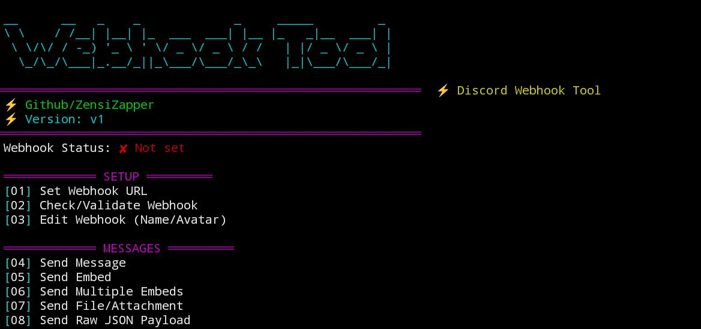

# 🚀 WebhookTool - Ultimate Discord Webhook Tool

A powerful Discord Webhook Tool written in Python.
---
## ⚡ Features

| # | Feature |
|---|---------|
| 01 | Set Webhook URL |
| 02 | Check/Validate Webhook |
| 03 | Edit Webhook Name & Avatar |
| 04 | Send Message |
| 05 | Send Embed |
| 06 | Send Multiple Embeds |
| 07 | Send File/Attachment |
| 08 | Send Raw JSON Payload |
| 09 | Send from JSON File |
| 10 | Send with Mentions |
| 11 | Send with Server Emojis by ID |
| 12 | Create Poll Embed |
| 13 | Spam Messages |
| 14 | Threaded Spam |
| 15 | Schedule Message |
| 16 | Repeat Message Loop |
| 17 | Bulk Webhook Validator |
| 18 | Export Webhook Info |
| 19 | View Message History |
| 20 | Delete Webhook |

---

## 📦 Installation

```bash
git clone https://github.com/ZensiZapper/WebhookTool.git
cd WebhookTool
pip install -r requirements.txt
python main.py
```
---

## ⚠️ Disclaimer

> This tool is for **educational purposes only**.  
> Abusing Discord webhooks violates [Discord's Terms of Service](https://discord.com/terms).  
> The developer is not responsible for any misuse.

---

## 📜 License
MIT License - see [LICENSE](LICENSE)

---
## 
